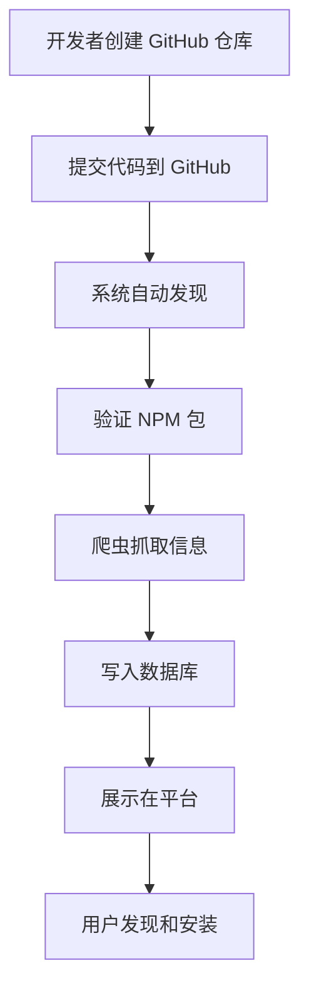
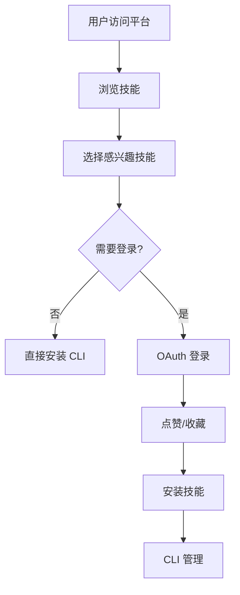

# EMP Skill Platform - 系统架构设计

## 🏗️ 整体架构

```
┌─────────────────────────────────────────────────────────────────┐
│                    EMP Skill Platform 架构                      │
├─────────────────────────────────────────────────────────────────┤
│                                                                 │
│  ┌─────────────────────────────────────────────────────────┐    │
│  │              CLI 层（packages/eskill/）                │    │
│  │  ├─ 完全独立运行                                         │    │
│  │  ├─ 纯本地操作                                           │    │
│  │  ├─ 零门槛安装                                           │    │
│  │  └─ 可选遥测                                              │    │
│  └─────────────────────────────────────────────────────────┘    │
│                               │                                  │
│                               │                                  │
│  ┌─────────────────────────────────────────────────────────┐    │
│  │             Web 平台层（apps/web/）                     │    │
│  │  ├─ TanStack Start (React 19)                          │    │
│  │  ├─ Tailwind CSS v4                                     │    │
│  │  ├─ Cloudflare Pages                                    │    │
│  │  └─ Cloudflare D1                                       │    │
│  └─────────────────────────────────────────────────────────┘    │
│                               │                                  │
│                               │                                  │
│  ┌─────────────────────────────────────────────────────────┐    │
│  │             数据源层                                        │    │
│  │  ├─ NPM Registry                                        │    │
│  │  ├─ GitHub API                                          │    │
│  │  └─ 技能目录爬虫                                           │    │
│  └─────────────────────────────────────────────────────────┘    │
│                                                                 │
│  ┌─────────────────────────────────────────────────────────┐    │
│  │             社区互动层                                      │    │
│  │  ├─ OAuth 认证（Google/GitHub）                         │    │
│  │  ├─ 点赞收藏系统                                         │    │
│  │  └─ 用户关系网络                                         │    │
│  └─────────────────────────────────────────────────────────┘    │
└─────────────────────────────────────────────────────────────────┘
```

## 🗂️ 数据流设计

### 技能发布流程



### 用户使用流程



## 🗄️ 数据库设计

### 核心表结构

#### users 表（用户表）
```sql
CREATE TABLE users (
  id TEXT PRIMARY KEY,
  name TEXT NOT NULL,
  avatar TEXT,
  provider TEXT NOT NULL,           -- 'google' | 'github'
  provider_id TEXT NOT NULL UNIQUE, -- OAuth 用户 ID
  created_at DATETIME DEFAULT CURRENT_TIMESTAMP
);
```

#### skills 表（技能表）
```sql
CREATE TABLE skills (
  id TEXT PRIMARY KEY,
  npm_package TEXT UNIQUE,           -- NPM 包名
  github_repo TEXT UNIQUE,           -- GitHub 仓库
  github_owner TEXT NOT NULL,
  name TEXT NOT NULL,
  slug TEXT UNIQUE NOT NULL,
  description TEXT NOT NULL,
  category TEXT,                     -- 技能分类
  tags TEXT,                        -- JSON 标签数组
  downloads INTEGER DEFAULT 0,       -- NPM 下载量
  github_stars INTEGER DEFAULT 0,    -- GitHub Star 数
  likes_count INTEGER DEFAULT 0,     -- 点赞数
  favorites_count INTEGER DEFAULT 0, -- 收藏数
  last_synced_at DATETIME,           -- 最后同步时间
  created_at DATETIME DEFAULT CURRENT_TIMESTAMP,
  updated_at DATETIME DEFAULT CURRENT_TIMESTAMP
);
```

#### likes 表（点赞表）
```sql
CREATE TABLE likes (
  user_id TEXT NOT NULL,
  skill_id TEXT NOT NULL,
  created_at DATETIME DEFAULT CURRENT_TIMESTAMP,
  PRIMARY KEY (user_id, skill_id),
  FOREIGN KEY (user_id) REFERENCES users(id) ON DELETE CASCADE,
  FOREIGN KEY (skill_id) REFERENCES skills(id) ON DELETE CASCADE
);
```

#### favorites 表（收藏表）
```sql
CREATE TABLE favorites (
  user_id TEXT NOT NULL,
  skill_id TEXT NOT NULL,
  created_at DATETIME DEFAULT CURRENT_TIMESTAMP,
  PRIMARY KEY (user_id, skill_id),
  FOREIGN KEY (user_id) REFERENCES users(id) ON DELETE CASCADE,
  FOREIGN KEY (skill_id) REFERENCES skills(id) ON DELETE CASCADE
);
```

#### sessions 表（Session 表）
```sql
CREATE TABLE sessions (
  id TEXT PRIMARY KEY,
  user_id TEXT NOT NULL,
  expires_at DATETIME NOT NULL,
  FOREIGN KEY (user_id) REFERENCES users(id) ON DELETE CASCADE
);
```

### 索引优化

```sql
-- 技能查询优化
CREATE INDEX idx_skills_slug ON skills(slug);
CREATE INDEX idx_skills_category ON skills(category);
CREATE INDEX idx_skills_downloads ON skills(downloads DESC);
CREATE INDEX idx_skills_likes_count ON skills(likes_count DESC);

-- 用户互动优化
CREATE INDEX idx_likes_user ON likes(user_id);
CREATE INDEX idx_likes_skill ON likes(skill_id);
CREATE INDEX idx_favorites_user ON favorites(user_id);
CREATE INDEX idx_favorites_skill ON favorites(skill_id);

-- Session 管理优化
CREATE INDEX idx_sessions_user ON sessions(user_id);
CREATE INDEX idx_sessions_expires ON sessions(expires_at);
```

## 🔄 API 设计

### 公开 API（无需认证）

#### 技能查询
```typescript
GET /api/skills              // 技能列表（分页）
GET /api/skills/:slug        // 技能详情
GET /api/search              // 搜索技能
GET /api/categories          // 分类列表
GET /api/skills/:slug/likes  // 点赞用户列表
```

#### 响应格式
```typescript
interface SkillsResponse {
  skills: Skill[]
  pagination: {
    page: number
    limit: number
    total: number
    hasMore: boolean
  }
  filters: {
    categories: string[]
    totalCount: number
  }
}
```

### 私有 API（需要认证）

#### 用户认证
```typescript
GET  /api/auth/google        // Google OAuth 登录
GET  /api/auth/github        // GitHub OAuth 登录
GET  /api/auth/callback/:provider  // OAuth 回调处理
GET  /api/auth/me            // 当前用户信息
POST /api/auth/logout        // 退出登录
```

#### 用户互动
```typescript
POST   /api/skills/:slug/like        // 点赞技能
DELETE /api/skills/:slug/like        // 取消点赞
POST   /api/skills/:slug/favorite    // 收藏技能
DELETE /api/skills/:slug/favorite    // 取消收藏
GET    /api/favorites                // 用户收藏列表
```

## 🔐 安全设计

### 数据来源验证

```typescript
// 技能来源验证规则
function validateSkillSource(source: SkillSource): ValidationResult {
  if (source.type === 'npm') {
    // NPM 包验证
    return /^@[\w-]+\/[\w-]+$/.test(source.identifier) ||
           /^[\w-]+$/.test(source.identifier)
  }

  if (source.type === 'github') {
    // GitHub 仓库验证
    return /^[\w-]+\/[\w-]+$/.test(source.identifier)
  }

  return { valid: false, reason: '不支持的数据源' }
}
```

### OAuth 安全措施

- ✅ HTTPS 强制使用
- ✅ State 参数验证
- ✅ Token 加密存储
- ✅ Session 过期时间
- ✅ CORS 限制
- ✅ Rate Limiting

### 数据隐私保护

- ✅ 匿名遥测（可选）
- ✅ 不收集使用行为
- ✅ 不记录 IP 地址
- ✅ 用户可删除数据
- ✅ 最小化数据收集

## 📊 性能优化

### 前端优化

#### 1. 代码分割
```typescript
// 路由级代码分割
const SkillDetail = lazy(() => import('./routes/skills.$slug'))
```

#### 2. 缓存策略
```typescript
// React Query 缓存
const skillsQuery = queryOptions({
  queryKey: ['skills'],
  queryFn: fetchSkills,
  staleTime: 5 * 60 * 1000,  // 5 分钟
  gcTime: 10 * 60 * 1000,    // 10 分钟
})
```

### 后端优化

#### 1. 数据库查询优化
```sql
-- 分页查询优化
SELECT * FROM skills
WHERE category = ?
ORDER BY downloads DESC
LIMIT ? OFFSET ?
```

#### 2. KV 缓存
```typescript
// 缓存热门技能
async function getPopularSkills(env: Env) {
  const cacheKey = 'popular-skills'
  let skills = await env.CACHE.get(cacheKey, 'json')

  if (!skills) {
    skills = await env.DB.prepare('SELECT * FROM skills ORDER BY downloads DESC LIMIT 10').all()
    await env.CACHE.put(cacheKey, JSON.stringify(skills), { expirationTtl: 3600 })
  }

  return skills
}
```

#### 3. Edge Computing
```typescript
// Cloudflare Workers 边缘计算
export default {
  async fetch(request: Request, env: Env) {
    // 在边缘处理请求
    const url = new URL(request.url)

    if (url.pathname === '/api/skills') {
      return handleSkillsRequest(request, env)
    }

    return new Response('Not Found', { status: 404 })
  }
}
```

## 🔄 爬虫系统设计

### 爬虫架构

```typescript
class SkillsCrawler {
  private baseUrl = 'https://example.com/skills'

  async crawlSkillsSh(): Promise<void> {
    // 1. 获取排行榜页面
    const html = await this.fetchPage('/')

    // 2. 解析技能列表
    const skills = this.parseLeaderboard(html)

    // 3. 逐个处理技能
    for (const skill of skills) {
      try {
        await this.processSkill(skill)
      } catch (error) {
        console.error(`Failed to process ${skill.name}:`, error)
      }
    }
  }

  private async processSkill(skill: CrawledSkill): Promise<void> {
    // 1. 验证 GitHub 仓库
    const repoInfo = await this.validateGitHubRepo(skill.repo)

    // 2. 查找 NPM 包
    const npmPackage = await this.findNPMPackage(skill.repo)

    // 3. 获取 NPM 数据
    const npmData = await this.fetchNPMData(npmPackage)

    // 4. 存储到数据库
    await this.saveSkill({
      ...repoInfo,
      npm_package: npmPackage,
      downloads: npmData.downloads,
      installs: skill.installs,
    })
  }
}
```

### 定时任务配置

```toml
# wrangler.toml
[triggers]
crons = [
  # 每天凌晨 3 点爬取技能目录
  "0 3 * * *",
  # 每小时同步 NPM 下载量
  "0 * * * *",
  # 每周日凌晨 4 点深度同步
  "0 4 * * 0"
]
```

## 📈 可扩展性设计

### 模块化架构

#### 1. 插件系统
```typescript
interface SkillPlugin {
  name: string
  version: string
  setup: (app: App) => void
  cleanup?: () => void
}

// 插件注册
const plugins: SkillPlugin[] = [
  new OAuthPlugin(),
  new AnalyticsPlugin(),
  new SearchPlugin(),
]

plugins.forEach(plugin => plugin.setup(app))
```

#### 2. 钩子系统
```typescript
interface Hooks {
  beforeSkillInstall: (skill: Skill) => Promise<void>
  afterSkillInstall: (skill: Skill, result: InstallResult) => Promise<void>
  onUserLogin: (user: User) => Promise<void>
  onSkillLike: (user: User, skill: Skill) => Promise<void>
}

// 钩子使用
await hooks.beforeSkillInstall(skill)
await installSkill(skill)
await hooks.afterSkillInstall(skill, result)
```

### 多租户支持

#### 1. 组织隔离
```typescript
interface Organization {
  id: string
  name: string
  domain: string
  settings: OrgSettings
}

// 按组织隔离数据
const orgSkills = await db.prepare(
  'SELECT * FROM skills WHERE org_id = ?',
  [orgId]
)
```

## 🧪 测试策略

### 单元测试
```typescript
// CLI 测试
describe('install command', () => {
  it('should install skill from GitHub', async () => {
    const result = await installCommand('vercel-labs/agent-skills')
    expect(result.success).toBe(true)
    expect(result.skill).toBeDefined()
  })
})
```

### 集成测试
```typescript
// API 测试
describe('skills API', () => {
  it('should return skills list', async () => {
    const response = await request(app)
      .get('/api/skills')
      .expect(200)

    expect(Array.isArray(response.body.skills)).toBe(true)
  })
})
```

### E2E 测试
```typescript
// Playwright 测试
test('user can browse skills', async ({ page }) => {
  await page.goto('/')
  await page.click('[data-testid="skill-card"]')
  await expect(page).toHaveURL(/\/skills\/.+/)
})
```

## 📋 总结

EMP Skill Platform 的架构设计遵循以下原则：

1. **分层架构** - CLI、Web、数据源、社区层的清晰分离
2. **安全优先** - 严格的数据源验证和隐私保护
3. **性能优化** - 多层次的缓存和查询优化
4. **可扩展性** - 插件系统和钩子机制
5. **用户体验** - 渐进式登录和零门槛使用

这种设计确保了系统的稳定、可维护和可扩展，为未来的功能扩展奠定了坚实的基础。